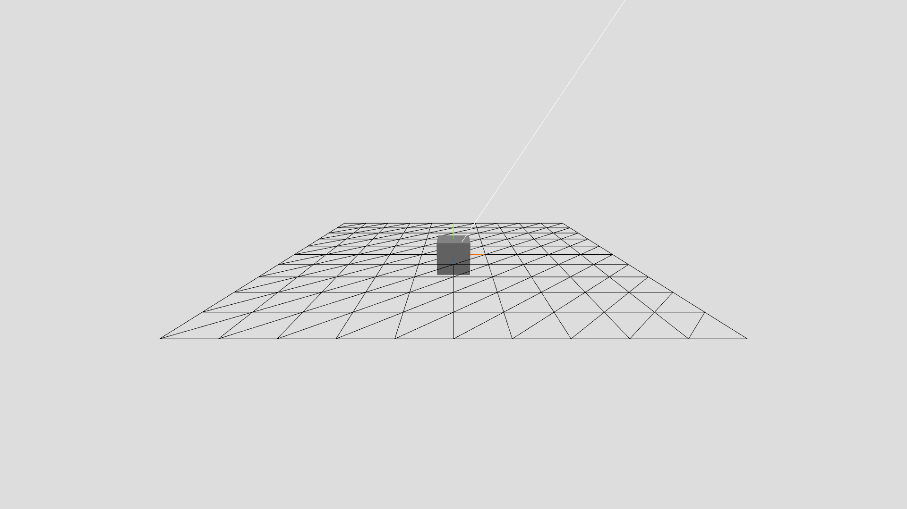

# three.js-pilot

[][demo]

## What is it?

`three.js-pilot` is a collection of very simple functions that add objects to a 
three.js scene, which can be used to...
- diagnose something (e.g. three.js, your camera, your renderer)
- quickly create samples (just like how Blender has _The Default Cube_)

The functions are simple because the only required argument to pass to those
functions is your three.js scene.

## Why?

When I jump into a three.js project, the first thing that I do is creating a
scene, a camera, and a renderer. After that I want to check if I've got the
camera and the renderer working properly by adding a mesh to the scene. For this
I _don't_ want to create new variables (because I would then have to create 3 
variables, one for the geometry, one for the material, and one for the mesh
itself) or writing `new Mesh( ... )` (because it's lengthy and ugly). I just
want something as simple as a single function call. I can now accomplish this
thanks to `three.js-pilot`. :grin:

## How to use it?

Grab `threejs-pilot.js` and include it in your project. And then just call the
function that meets your needs. Here are the functions.

- **`addCube`**: Adds a mesh to your scene (default mesh is a grey cube)
- **`addPlane`**: Adds a plane to your scene (by default, a wireframed plane)
- **`addDirectionalLight`**: Adds a directional light to your scene
- **`addPointLight`**: Adds a point light to your scene
- **`addAxesHelper`**: Adds an `AxesHelper` to your scene
- **`kickstart`**: Adds a default cube, a default plane, a default directional
  light, and a default `AxesHelper` to your scene using the above functions

For more details, read the docstrings that I've added in `threejs-pilot.js`.
And be sure to visit the [demo][demo] page to see `three.js-pilot` in action!
:rocket:

If you want to import `three.js-pilot` as a module, use
`threejs-pilot.module.js`.

[demo]: https://you-create.github.io/three.js-pilot/

## Why the name?

If a cube sits in a plane, what is it then? A pilot! :man_pilot:

## Public Domain!

Everything in this repository (except for the `LICENSE`) is licensed under the
Creative Commons Zero v1.0 Universal. This means that `three.js-pilot` is a
dedication to the Public Domain, and you are free to do anything with it (yep,
attribution not required :smile:). A copy of the license is included in the
repository.
